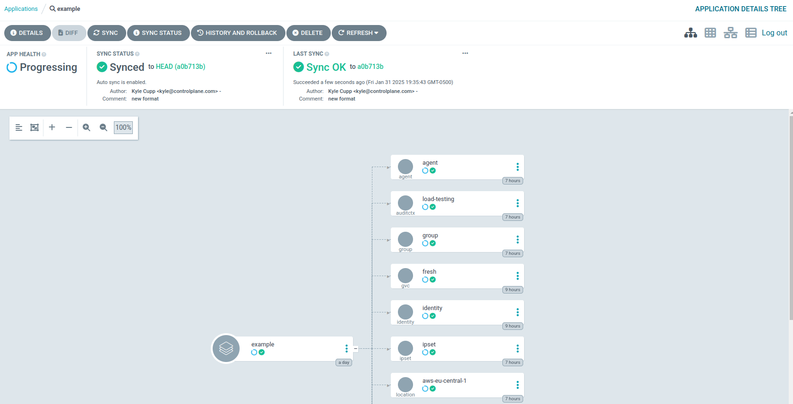

# Control Plane Kubernetes Operator
A Kubernetes operator for [Control Plane](https://controlplane.com). This project allows you to manage many Control Plane
resources using Kubernetes custom resource definitions (CRDs). 

## Prerequisites
- A [Kubernetes](https://kubernetes.io) cluster with [Cert Manager](https://cert-manager.io) installed.
- The [Helm](https://helm.sh) CLI
- A [Control Plane](https://controlplane.com) account

## Installation
1. Ensure the prerequisites are met. If you don't already have a Kubernetes cluster, [kind](https://kind.sigs.k8s.io/) is a great 
   way to get started.
2. (Optional) [Install ArgoCD](https://argo-cd.readthedocs.io/en/stable/getting_started/)
3. Run
   ``` shell
   helm repo add cpln https://controlplane-com.github.io/k8s-operator 
   helm install cpln-operator cpln/cpln-operator` 
   ```
4. Provision a [Service Account](https://docs.controlplane.com/reference/serviceaccount#service-account), taking note of 
   the generated token.
5. Create a secret named after your org in the `controlplane` namespace of your Kubernetes cluster. e.g.
   ```yaml
   apiVersion: v1
   data:
      token: eW91ci10b2tlbi1oZXJl #base64-encoded token
   kind: Secret
   metadata:
      name: my-org
      namespace: controlplane
   type: Opaque
   ```

## Usage

Create a custom resource for one of the supported kinds from the list below. The operator will use the secret you 
configured to sync the resource with Control Plane.

### Guidelines
- All resources must contain the `org` property, which tells the operator what the target org is, and therefore which
  secret to use
- Some kinds also require a `gvc` property, which tells the operator what the target GVC is.
- Consult the [custom resource definitions](chart/templates/crd) for information about the available and required fields. 
- For gvc-scoped kinds, a namespace per GVC is recommended.
- For org-scoped kinds, a namespace per org is recommended.

## Argo CD
The operator integrates closely with [ArgoCD](https://argoproj.github.io/cd/). There is no special configuration needed
for this to work. Once the operator is installed, you can point Argo at a Git repository containing yaml manifests or a 
Helm chart, and you're off to the races!



### Example Repository
https://github.com/cuppojoe/argo-example

## Supported Kinds
The operator supports:
- `agent`
- `auditcontext`
- `group`
- `gvc`
- `identity`
- `ipset`
- `location`
- `policy`
- `volumeset`
- `workload`

