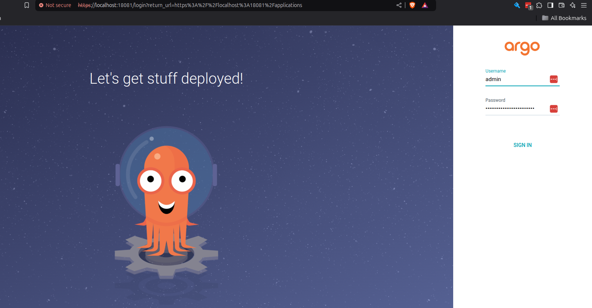

# Control Plane Kubernetes Operator

A Kubernetes operator for [Control Plane](https://controlplane.com). This project allows you to manage many Control
Plane resources using Kubernetes custom resource definitions (CRDs).

## Prerequisites

- A [Kubernetes](https://kubernetes.io) cluster with [Cert Manager](https://cert-manager.io/docs/installation/)
  installed.
- The [Helm](https://helm.sh) CLI
- A [Control Plane](https://controlplane.com) account

## Installation

### Quickstart

If you don't already have a Kubernetes cluster, run the command below to get a local [kind](https://kind.sigs.k8s.io/) cluster up and running.

```shell  
make cluster-quickstart
```

### Manual Installation

If you already have a cluster:

1. Install [Cert Manager](https://cert-manager.io/docs/installation/).
2. (Optional) [Install ArgoCD](https://argo-cd.readthedocs.io/en/stable/getting_started/).
    - If you decide to install Argo later, you'll need to upgrade your Helm installation to enable Argo-specific
      features. To do so, run:

   ```shell 
   helm upgrade cpln-operator cpln/cpln-operator
   ``` 

3. Run the following commands:

   ```shell
   helm repo add cpln https://controlplane-com.github.io/k8s-operator 
   helm install cpln-operator cpln/cpln-operator
   ```

## Granting the Operator Access to Your Control Plane Org

First, provision
a [Control Plane Service Account](https://docs.controlplane.com/reference/serviceaccount#service-account).

1. Create the Service Account as a member of the `superusers` group to start. Later, you can move it to a group with
   narrower permissions if you wish.
2. Create a [key](https://docs.controlplane.com/reference/serviceaccount#service-account-keys), and store it somewhere
   for safekeeping.
3. Run the following command:

   ```shell 
   make install-secret org=your-org-name key=your-service-account-key
   ```

## Usage

Create a custom resource for one of the supported kinds from the list below. The operator will use the secret you
configured to sync the resource with Control Plane.

### Guidelines

- All resources must contain the `org` property, which tells the operator what the target org is and, therefore, which
  secret to use.
- Some kinds also require a `gvc` property, which tells the operator what the target GVC is.
- Consult the [custom resource definitions](chart/templates/crd) for information about the available and required
  fields.
- For GVC-scoped kinds, a namespace per GVC is recommended.
- For org-scoped kinds, a namespace per org is recommended.

## Preventing Resource Deletion

Deleting a Kubernetes resource while the controller is installed and running will remove the corresponding resource from
Control Plane. You can prevent this by adding a special annotation to the Kubernetes resource anytime before deletion,
e.g.:

```yaml
kind: gvc
metadata:
  name: fresh
  namespace: default
  annotations:
    cpln.io/resource-policy: keep
apiVersion: cpln.io/v1
description: fresh
org: kyle-test-org-2
tags: {}
spec:
  loadBalancer:
    dedicated: false
  staticPlacement:
    locationLinks:
      - //location/aws-eu-central-1
```

## Argo CD

The operator integrates closely with [ArgoCD](https://argoproj.github.io/cd/). There is no special configuration needed
for this to work. Once the operator is installed, you can point Argo at a Git repository containing YAML manifests or a
Helm chart, and you're off to the races!


### Example App
Here's a example Argo Application. It pulls a helm chart located in the repository: [https://github.com/cuppojoe/argo-example](https://github.com/cuppojoe/argo-example).
Be sure to replace `your-org-name-here` with your Control Plane org name. Note that the domain object in this example will not become healthy, since the domain
is not owned by your org. It is there for illustrative purposes only.

Simply save the yaml below to a file (e.g. `app.yaml`), and run something like
```shell 
kubectl -n argocd apply -f app.yaml
```

```yaml 
apiVersion: argoproj.io/v1alpha1
kind: Application
metadata:
  name: my-helm-app
  namespace: argocd  # This is usually where Argo CD is installed
spec:
  project: default
  destination:
    server: 'https://kubernetes.default.svc'  # Cluster API server URL
    namespace: fresh                  # Target namespace in your cluster
  source:
    repoURL: 'https://cuppojoe.github.io/argo-example/'  # URL of your Helm repository
    chart: argo-example                              # Name of the Helm chart
    targetRevision: 0.2.3                        # Chart version (can be a version, branch, etc.)
    helm:
      # Inline values override (optional)
      values: |
        org: your-org-name-here
  syncPolicy:
    automated:
      prune: true      # Automatically delete resources that are no longer defined in the chart
      selfHeal: true   # Automatically sync drifted resources

```
### Connecting to the Argo UI
For a fresh install, run the commands below to print the initial admin password, and forward port 18081 to the Argo UI.
```shell 
#print the initial admin password
kubectl -n argocd get secret argocd-initial-admin-secret -o json | jq '.data.password' -r | base64 -d -

#connect to the argo UI
kubectl -n argocd port-forward service/argocd-server 18081:443
```
Next, open a browser window and navigate to localhost:18081. Trust the self-signed certificate, and log in with user: admin, pass: <initial-admin-password>


## Supported Kinds

The operator supports:

- `agent`
- `auditcontext`
- `domain`
- `group`
- `gvc`
- `identity`
- `ipset`
- `location`
- `policy`
- `volumeset`
- `workload`
- `secret` ([Secrets are a special case](#secrets))

## Secrets

For security reasons, secret data must be stored using a native Kubernetes Secret object, not a custom resource. This
makes it slightly different from the other kinds.

**Note the `app.kubernetes.io/managed-by` label, and the `cpln.io/org` annotation in the example below.**

### Example

```yaml
apiVersion: v1
kind: Secret
type: opaque
metadata:
  labels:
    app.kubernetes.io/managed-by: cpln-operator # Secrets without this label are ignored
  name: secret
  namespace: default
  annotations:
    cpln.io/org: kyle-test-org # Replace this with your org name. This is required.
data:
  encoding: cGxhaW4= # plain
  payload: c2VjcmV0LXZhbHVl # secret-value
```
 
